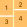

<p align="center">

<h1 align="center">Number Formatter</h1>
</p>

## Table of Contents
- [Project description](#project-description)
- [Installation](#installation)


## Project description
A small utility script for formatting numbers based on three formats: SHORT, COMMA, SPACE

## Installation
```
npm i
npm run build
```


